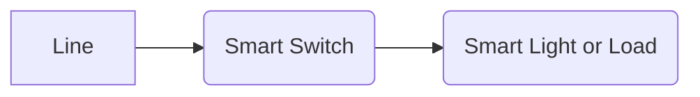

# Home Assistant Runbook

This guide details the design, implementation and troubleshooting tips for our Home Assistant installation.

## Design Theory

The physical and logical design of this Home Assistant installation is bound by the premise that the home should continue to funtion, with or without a functioning HA installation. The general requirements are as follows: 

* Light switches should always turn on/turn off the downstream fixtures and outlets, regardless of if home assistant is offline
* All smart light fixtures will have a smart switch that controls them
* All lights should default power-on to sane illuminance values for any time of day
* Lighting should start the day with blue tones, and shift orange and lower in illuminance as the day progresses
* Modifications to the home should be limited to alterations that can be undone/replaced by any future home owner
* Teardown of the system in prepartion for a move/home sale should be limited to 3-4 hours of work and all hardwired devices should be left behind
* Home Assistant configuration files should be backed-up to the cloud
* Spare compute hardware should be onsite for immediate installation
* One (1) spare of each hardwired device will be onsite for immediate installation
* All hardwired devices must use the Zigbee protocol
* All harware in the system should default to local control only, where reasonable
* All connected appliances with cloud connectivity requirements must be put on an isolated wifi network
* All hardware must support a fail-to-safe condition, e.g., valves default to normally-closed, relays default to normally open
* Energy efficiency must be maximized - the smart home should "save" more energy than it consumes
* All connected appliances with cloud connectivity requirements must have unique accounts with unique, highly complex passwords
* Users may be tracked for the purposes of eventing within the system, but their historical location information maynot be persisted
* Cloud-connected voice assistants and video solutions are prohibited
* Video solutions will be confined to publically accessible spaces, e.g., no cameras within the home or where visual privacy is "expected"

## Hardware 

One of the main features of our smart home is that all smart lighting fixtures have a smart switch upstream that controls their power. This design choice ensures that light switches can be used and the home can   

